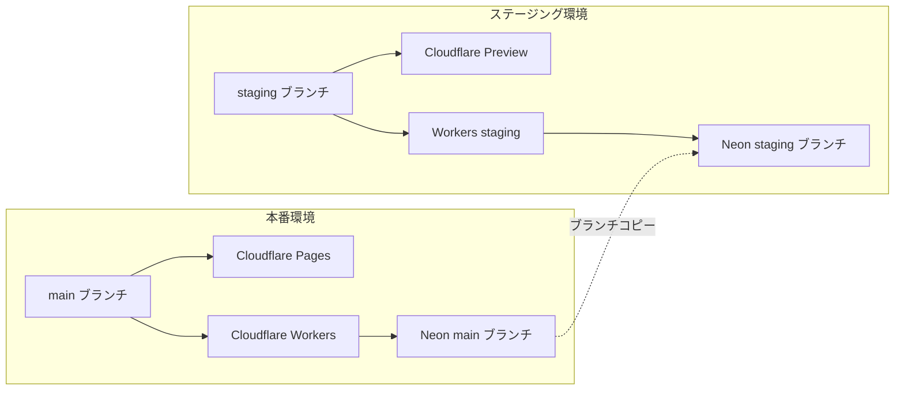

# ステージング環境構築プラン

## Context

本番環境と分離したステージング環境を構築し、UIリデザイン + バックエンド移行を安全にテスト・開発する。新スタック（Neon + Cloudflare + Clerk）はブランチング・Preview デプロイの仕組みが充実しており、追加費用 $0 で環境分離が可能。

## 全体構成

```
本番: main   → Cloudflare Pages (Production) + Workers (Production) + Neon main ブランチ
STG:  staging → Cloudflare Pages (Preview)    + Workers (staging)    + Neon staging ブランチ
```



### 追加費用: $0

| サービス           | ステージング                           | 追加費用 |
| ------------------ | -------------------------------------- | -------- |
| Neon               | staging ブランチ（本番データのコピー） | $0       |
| Cloudflare Pages   | Preview デプロイ（自動生成）           | $0       |
| Cloudflare Workers | staging 環境                           | $0       |
| Clerk              | Development インスタンス               | $0       |
| Cloudflare R2      | 本番と共用 or 別バケット               | $0       |

---

## やることリスト（手動 vs 自動化）

### A. ユーザー手動作業（各サービスのダッシュボード）

#### A-1. Neon ステージングブランチ作成

1. [Neon Console](https://console.neon.tech) でプロジェクトにアクセス
2. staging ブランチを作成（本番データのコピーが自動生成される）
3. staging ブランチの接続文字列をメモ

```bash
# CLI でも可能（1コマンド）
neonctl branches create --name staging
```

#### A-2. Cloudflare Pages 設定

1. [Cloudflare Dashboard](https://dash.cloudflare.com) > Pages でプロジェクト作成
2. Git リポジトリを接続
3. ビルド設定:
   - Production branch: `main`
   - Preview branch: `staging`（staging ブランチ push で自動 Preview デプロイ）
   - Build command: `cd frontend && bun run build`
   - Build output directory: `frontend/dist`

#### A-3. Cloudflare Workers 設定

1. Workers > 新規作成で staging 用の Worker を作成
2. 環境変数を設定（A-5 参照）
3. カスタムドメイン or ルーティングを設定

#### A-4. Clerk Development インスタンス

1. [Clerk Dashboard](https://dashboard.clerk.com) で Development インスタンスを作成
2. Google OAuth プロバイダーを有効化
3. API Keys（Publishable Key + Secret Key）をメモ
4. Allowed origins にステージング URL を追加

#### A-5. 環境変数設定

**Cloudflare Workers（staging）:**

| 変数名                       | 値                                   |
| ---------------------------- | ------------------------------------ |
| `DATABASE_URL`               | Neon staging ブランチの接続文字列    |
| `CLERK_SECRET_KEY`           | Clerk Development の Secret Key      |
| `CLERK_PUBLISHABLE_KEY`      | Clerk Development の Publishable Key |
| `GOOGLE_CHAT_WEBHOOK_URL`    | 本番と同じ値（※注意）                |
| `GOOGLE_OAUTH_CLIENT_ID`     | ステージング用 OAuth Client ID       |
| `GOOGLE_OAUTH_CLIENT_SECRET` | ステージング用 OAuth Secret          |
| `GITHUB_TOKEN`               | 本番と同じ値（※注意）                |

**Cloudflare Pages（Preview 環境変数）:**

| 変数名                       | 値                                   |
| ---------------------------- | ------------------------------------ |
| `VITE_API_URL`               | Workers staging の URL               |
| `VITE_CLERK_PUBLISHABLE_KEY` | Clerk Development の Publishable Key |

#### A-6. GitHub Secrets（CI/CD 用）

1. リポジトリ Settings > Secrets and variables > Actions
2. 以下を設定:
   - `CLOUDFLARE_API_TOKEN`: Cloudflare API トークン
   - `CLOUDFLARE_ACCOUNT_ID`: Cloudflare アカウント ID
   - `NEON_API_KEY`: Neon API キー（オプション: CI でブランチ操作する場合）

---

### B. エージェント自動化作業（コード変更）

#### B-1. `wrangler.toml` にステージング環境追加

```toml
# wrangler.toml
name = "chumo-api"
main = "src/index.ts"
compatibility_date = "2024-01-01"

[env.staging]
name = "chumo-api-staging"
vars = { ENVIRONMENT = "staging" }

[env.production]
name = "chumo-api"
vars = { ENVIRONMENT = "production" }
```

#### B-2. `.env.example` 新規作成

- 全環境変数の一覧テンプレート（値なし）を Git 管理
- `.gitignore` に `.env.staging` を追加

#### B-3. `package.json` にステージング用スクリプト追加

```json
{
  "scripts": {
    "dev": "wrangler dev",
    "deploy:staging": "wrangler deploy --env staging",
    "deploy:production": "wrangler deploy --env production",
    "db:migrate:staging": "DATABASE_URL=$STAGING_DATABASE_URL drizzle-kit migrate",
    "db:migrate:production": "DATABASE_URL=$PRODUCTION_DATABASE_URL drizzle-kit migrate"
  }
}
```

#### B-4. `.github/workflows/deploy-staging.yml` 新規作成

```yaml
name: Deploy Staging
on:
  push:
    branches: [staging]

jobs:
  deploy-frontend:
    runs-on: ubuntu-latest
    steps:
      - uses: actions/checkout@v4
      - uses: oven-sh/setup-bun@v1
      - run: cd frontend && bun install && bun run build
      # Cloudflare Pages は git push で自動デプロイされるため、
      # 手動デプロイが必要な場合のみ wrangler pages deploy を使用

  deploy-backend:
    runs-on: ubuntu-latest
    steps:
      - uses: actions/checkout@v4
      - uses: oven-sh/setup-bun@v1
      - run: cd backend && bun install
      - run: cd backend && npx wrangler deploy --env staging
        env:
          CLOUDFLARE_API_TOKEN: ${{ secrets.CLOUDFLARE_API_TOKEN }}
          CLOUDFLARE_ACCOUNT_ID: ${{ secrets.CLOUDFLARE_ACCOUNT_ID }}

  migrate-db:
    runs-on: ubuntu-latest
    needs: deploy-backend
    steps:
      - uses: actions/checkout@v4
      - uses: oven-sh/setup-bun@v1
      - run: cd backend && bun install
      - run: cd backend && npx drizzle-kit migrate
        env:
          DATABASE_URL: ${{ secrets.STAGING_DATABASE_URL }}
```

---

## 実施順序

| 順番 | 作業                               | 担当                     |
| ---- | ---------------------------------- | ------------------------ |
| 1    | Neon staging ブランチ作成          | ユーザー (A-1)           |
| 2    | Clerk Development インスタンス作成 | ユーザー (A-4)           |
| 3    | Cloudflare Pages / Workers 設定    | ユーザー (A-2, A-3)      |
| 4    | コード変更（B-1〜B-4）             | エージェント             |
| 5    | 環境変数設定                       | ユーザー (A-5)           |
| 6    | GitHub Secrets 設定                | ユーザー (A-6)           |
| 7    | DB マイグレーション実行            | エージェント or ユーザー |
| 8    | `staging` ブランチ作成 + push      | エージェント             |
| 9    | 動作検証                           | ユーザー                 |

---

## 検証方法

1. ステージング URL にアクセス → ログイン画面表示を確認
2. Clerk 経由の Google ログインフロー完了を確認
3. タスク CRUD 操作の動作確認（Hono API → Neon staging ブランチ）
4. 外部連携（Drive / GitHub / Chat）の動作確認
5. 本番環境に影響がないことを確認（Neon main ブランチのデータが変更されていない）

---

## 注意点

- **外部連携の分離**: Google Chat / Drive / GitHub 連携は本番と同じ値を使用する場合、ステージングからの操作が本番の Chat / Drive / GitHub に反映される点に注意
- **Neon ブランチのリセット**: ステージングデータを本番に合わせたい場合は `neonctl branches reset staging --parent` で本番からコピーし直せる
- **R2 ストレージ**: ステージング用に別バケットを作るか、本番と共用するか要検討（ファイルの分離が必要な場合は別バケット推奨）
- **環境変数の共有**: `.env.staging` は Git 管理しないので、チーム共有方法を別途決めておく（Cloudflare の環境変数管理 or 1Password 等）
