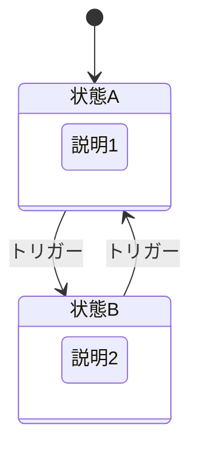
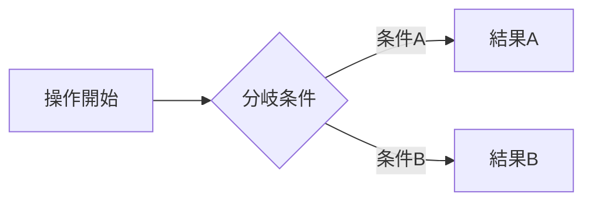

# [機能名] 仕様書

> ステータス: **ドラフト**

## 背景・目的

### Who

[この機能を使う人。役割、スキルレベル、利用シーン]

### What

[その人が達成したいこと。動詞で記述]

### Why

- [現状の課題]
- [なぜ今これが必要か]

### Constraint

- [技術的制約]
- [プロダクト制約]
- [その他の制約]

---

## 機能要件

### Must（Phase 1）

- [ないと機能として成立しないもの]

### Should（Phase 2）

- [あると価値が上がるが、後からでも追加可能]

### Could（Phase 3）

- [将来的に検討する拡張]

---

## データ構造

```typescript
// Firestoreパス: [コレクションパス]
interface [TypeName] {
  id: string;
  // ...
}
```

### Firestoreセキュリティルール

| 操作     | 本人    | 他ユーザー | 未ログイン |
| -------- | ------- | ---------- | ---------- |
| 読み取り | ✅ / ❌ | ✅ / ❌    | ✅ / ❌    |
| 書き込み | ✅ / ❌ | ✅ / ❌    | ✅ / ❌    |

```
match /[collectionPath] {
  allow read, write: if [条件];
}
```

---

## 画面・UI

### 状態遷移



### レイアウト構成

```
[ASCII図でレイアウトを表現]
```

### 操作フロー



---

## エッジケース・制約

- **[ケース名]**: [挙動の説明]

---

## 非機能要件

### パフォーマンス

- [パフォーマンスに関する要件]

### セキュリティ

- [セキュリティに関する要件]

---

## スコープ外

- [明示的にやらないこと]

---

## 選定理由

### [選定項目]

[なぜその設計を選んだか。比較した代替案があれば簡潔に]
