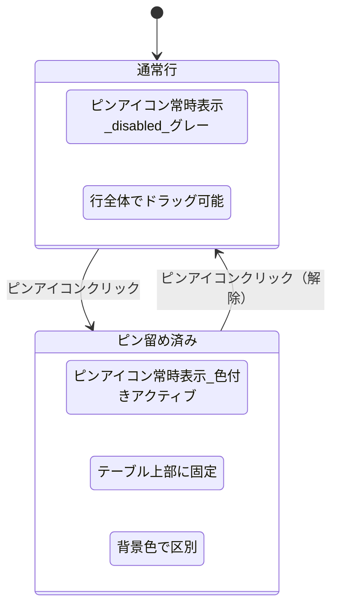
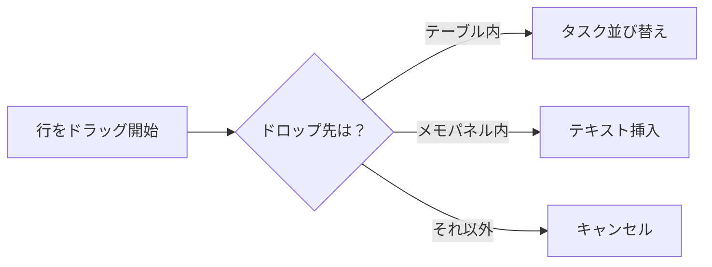

# タスクピン留め 仕様書

> ステータス: **レビュー済み**

## 背景・目的

### Who

チームメンバー（タスク管理ツールの日常利用者）

### What

ダッシュボードのタスク一覧で、個人的にタスクの優先順位を管理する

### Why

- 「今日やるべきタスク」を視覚的に把握したい
- ピンを外す行為が「対応済み」の意味を持つため、作業の進捗管理が自然にできる
- 優先順位は個人ごとに異なるため、プライベートな仕組みが必要

### Constraint

- ピン状態はプライベート（本人のみ閲覧可能）
- 既存のテーブル/カードビューに統合する
- 既存のD&D並び替え機能と共存する
- 技術スタック: Next.js + Tailwind + React Aria + Motion + Firebase/Firestore

---

## 機能要件

### Must（Phase 1）

- 既存のドラッグハンドル列を廃止し、ピンアイコン列に置き換える
- タスク行全体をドラッグ可能にする（@dnd-kit のリスナーを TableRow に設定）
- ピンアイコンは全行に常時表示（通常行: disabled/グレー、ピン留め済み: 色付きアクティブ）
- ピンアイコンをクリックするとタスクがテーブル上部に固定表示される
- ピン留めタスクは常に非ピン留めタスクより上に表示される（D&Dでもこの境界は越えられない）
- ピン解除するとタスクはピン留めタスクより下の通常位置に移動する
- ピン状態はプライベート（他のユーザーには見えない）
- ピン留めされたタスクは視覚的に区別できる（背景色 + 色付きピンアイコン）

### Should（Phase 2）

- カードビューでもピン留め機能が動作する
- ピン留めタスク同士のD&Dによる並び替え

### Could（Phase 3）

- ピン留めタスクの自動解除（タスク完了時）

---

## データ構造

```typescript
// Firestoreパス: users/{userId}/taskPins/{pinId}
interface TaskPin {
  id: string;
  userId: string;
  taskId: string;
  projectType: ProjectType;
  order: number; // ピン留めタスク内での並び順
  pinnedAt: Date;
}
```

### Firestoreセキュリティルール

| 操作     | 本人 | 他ユーザー | 未ログイン |
| -------- | ---- | ---------- | ---------- |
| 読み取り | ✅   | ❌         | ❌         |
| 書き込み | ✅   | ❌         | ❌         |

```
match /users/{userId}/taskPins/{pinId} {
  allow read, write: if request.auth != null && request.auth.uid == userId;
}
```

---

## 画面・UI

### ピン留めのUI

```
テーブル全体:
┌────┬───────────────┬────────┬──────┐  ← ピンエリア
│ 📌 │ タスクA（ピン済）│ 田中   │ ...  │    （色付きピン + 薄い背景色）
│ 📌 │ タスクB（ピン済）│ 佐藤   │ ...  │
├────┼───────────────┼────────┼──────┤  ← 境界線
│ ◻️ │ タスクC        │ 田中   │ ...  │  ← 通常エリア
│ ◻️ │ タスクD        │ 佐藤   │ ...  │    （グレーのdisabledピン）
└────┴───────────────┴────────┴──────┘
 ↑ 全行にピンアイコン常時表示（行全体でドラッグ可能）
```

### 操作フロー



#### D&D判定ルール



---

## エッジケース・制約

- **タスクが完了した場合**: ピンは自動解除しない（Phase 1）。ユーザーが手動で解除
- **ピン留め上限**: 制限なし（ただし多すぎると本来の意味が薄れるため、UIで注意を促すことは検討）
- **フィルター適用時**: ピン留めタスクもフィルター対象になる（フィルターで非表示になる可能性あり）
- **複数プロジェクトのタスク**: プロジェクトをまたいでピン留め可能（taskPinにprojectType保存）
- **ドラッグハンドル廃止の影響**: 既存のD&D並び替えは行全体ドラッグに変更。操作感の変化はあるが、モダンなUIパターンとして自然

---

## 非機能要件

### パフォーマンス

- ピン留め操作: 即座に Firestore に反映（楽観的更新）

### セキュリティ

- ピン留めデータは Firestore セキュリティルールで本人のみアクセス可能に制限

---

## スコープ外

- ピン留めの自動解除ルール（Phase 1）
- ピン留めの通知機能
- 他ユーザーのピン状態の閲覧
- モバイルアプリ対応

---

## 選定理由

### ドラッグハンドル廃止 → ピンアイコン列

既存のドラッグハンドル列をピンアイコンに置き換えることで、列数を増やさずにピン留め機能を追加。D&Dは行全体から可能にすることで、ドラッグハンドルがなくても並び替え操作ができる。@dnd-kit の実装変更は最小限（リスナーの適用先を変更するだけ）。

### プライベートなピン留め

優先順位は個人の作業状況によって異なるため、共有ピンではなく個人ピンとする。チーム全体のタスク優先度は既存のステータス・進捗で管理する棲み分け。
