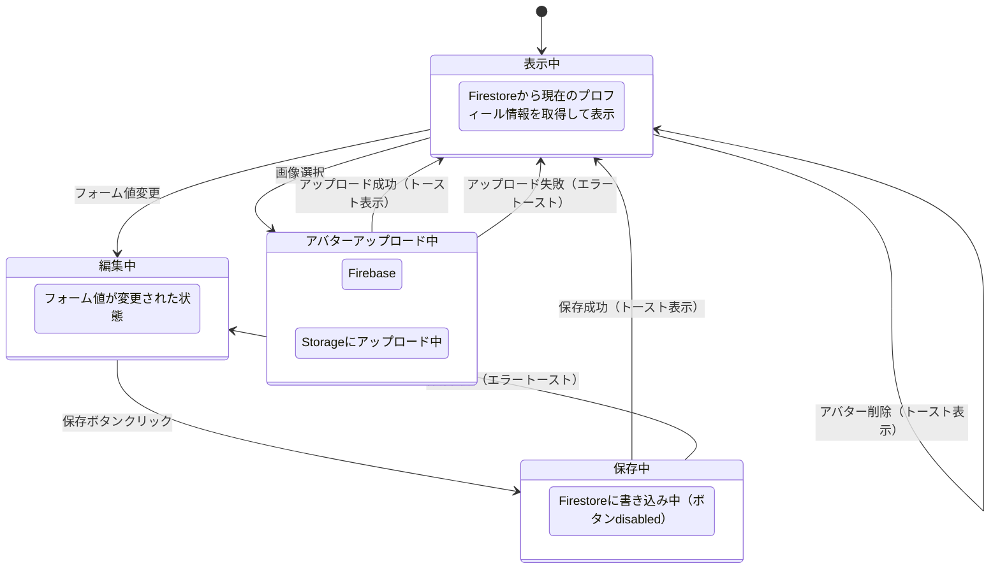
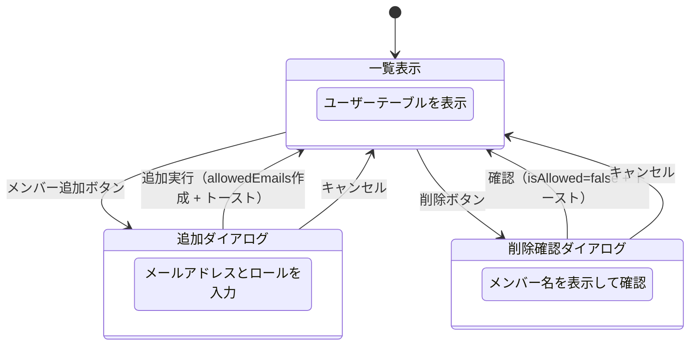
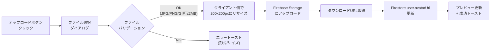
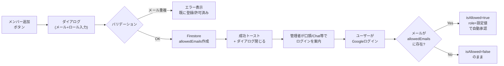

# 設定画面 仕様書

> ステータス: **確定**

## 背景・目的

### Who

チームメンバー（admin / member）。日常的にタスク管理ツール「ちゅも」を使う開発者・ディレクター。

### What

- 自分のプロフィール（アバター画像・アイコンカラー・表示名・肩書き）を管理する
- 外部サービス（Google Drive / GitHub / Google Chat）との連携を設定する
- プッシュ通知の受信設定を管理する
- （admin限定）メンバーのロール変更・追加・削除を行う

### Why

- 現在の設定画面は全設定項目がフラットに1ページに並んでおり、項目増加で見通しが悪い
- プロフィール編集機能（アバター・表示名変更・肩書き）が存在しない
- メンバー管理が `isAllowed` トグルのみで、ロール変更・追加・削除ができない
- タブ構成にすることでカテゴリ分けと将来の拡張性を確保する

### Constraint

- **技術スタック**: Tailwind CSS + React Aria + Motion（新スタック。MUI v7 からの移行対象）
- **アバター画像保存先**: Firebase Storage
- **データベース**: 既存 Firestore `users` コレクションのスキーマを拡張
- **テーマ**: Light / Dark 両対応（デザイン済み: `designs/design.pen`）
- **既存OAuth維持**: Google Drive 連携の OAuth フローは既存実装を維持
- **既存コンポーネント**: 新スタックで再実装するため、既存の MUI コンポーネントは参考のみ

---

## 機能要件

### Must（Phase 1）

#### 共通

- タブナビゲーション（左サイドバー形式、4タブ）
- ネストルートによるタブ切り替え（`/settings/profile`, `/settings/integrations`, `/settings/notifications`, `/settings/admin`）
- `/settings` アクセス時は `/settings/profile` にリダイレクト
- admin 以外のユーザーには「メンバー管理」タブを非表示
- Light / Dark テーマ対応
- 操作成功時のトースト通知（統一フィードバック）

#### プロフィールタブ

- アバター画像アップロード（JPG, PNG, GIF / 最大 2MB）
- アバター画像削除
- アイコンカラー選択（6色: teal, blue, green, amber, red, neutral）
- アイコンカラーはアバター画像未設定時の背景色として使用
- 表示名の編集
- 肩書きの編集
- 保存ボタンでプロフィール一括保存
- 保存成功時: トースト「プロフィールを保存しました」

#### 連携タブ

- Google Drive 連携（OAuth 認証フロー）
  - 未連携時: 「連携する」ボタン表示
  - 連携済み時: 連携済みステータス表示
- GitHub ユーザー名の入力・保存
- Google Chat ユーザー ID の入力・保存
- 各保存成功時: トースト「設定を保存しました」

#### 通知タブ

- プッシュ通知の ON/OFF トグル
- トグル ON 時: FCM トークン取得 → Firestore に保存
- トグル OFF 時: FCM トークン削除

#### メンバー管理タブ（admin限定）

- ユーザー一覧テーブル（メンバー名 / メール / Google Chat / ロール / 操作）
- ロール変更ドロップダウン（Admin / Member）
- メンバー削除ボタン（論理削除: `isAllowed = false`）
- 削除前に確認ダイアログ表示
- メンバー追加ボタン → メール許可リスト方式（ダイアログでメアド + ロール入力）

### Should（Phase 2）

- アバター画像のクロップ/リサイズ UI
- Google Drive 連携解除機能
- 自分自身の削除防止（admin が自分を削除できない）
- メール招待方式への移行（Resend 等でメール通知を送信）

### Could（Phase 3）

- メール通知設定（通知タブの拡張）

---

## データ構造

### User 型定義の拡張

```typescript
// Firestoreパス: users/{userId}
export type IconColor = 'teal' | 'blue' | 'green' | 'amber' | 'red' | 'neutral';

export interface User {
  id: string;
  email: string;
  displayName: string;
  role: UserRole; // 'admin' | 'member'
  isAllowed: boolean;

  // 🆕 プロフィール関連
  avatarUrl?: string; // Firebase Storage のダウンロード URL
  iconColor?: IconColor; // アイコンカラー（デフォルト: 'teal'）
  title?: string; // 肩書き（例: 'フロントエンドエンジニア'）

  // 既存フィールド
  githubUsername?: string;
  chatId?: string;
  fcmTokens?: string[];
  createdAt: Date;
  updatedAt: Date;
}

// Firestoreパス: users/{userId}/private/oauth
// OAuthトークンは本人のみアクセス可能なサブコレクションに分離
export interface UserOAuthSecret {
  googleRefreshToken?: string;
  googleOAuthUpdatedAt?: Date;
}
```

### アイコンカラーマッピング

| キー      | 背景色    | 用途                         |
| --------- | --------- | ---------------------------- |
| `teal`    | `#C5F2F1` | デフォルト。ブランドカラー系 |
| `blue`    | `#DBEAFE` |                              |
| `green`   | `#DCFCE7` |                              |
| `amber`   | `#FEF3C7` |                              |
| `red`     | `#FEE2E2` |                              |
| `neutral` | `#E5E7EB` |                              |

### AllowedEmail 型定義（新規）

```typescript
// Firestoreパス: allowedEmails/{docId}
export interface AllowedEmail {
  id: string;
  email: string; // 許可するメールアドレス
  role: UserRole; // ログイン時に付与するロール
  addedBy: string; // 追加した admin の userId
  createdAt: Date;
}
```

### Firebase Storage パス

```
avatars/{userId}/{filename}
```

- ファイル名はアップロード時に `{userId}_{timestamp}.{ext}` 形式で生成
- 古い画像は上書きではなく新規作成 → 保存成功後に旧ファイルを削除

### Firestoreセキュリティルール

#### users コレクション

| 操作                                          | 本人 | 他ユーザー（認証済み） | 未ログイン |
| --------------------------------------------- | ---- | ---------------------- | ---------- |
| 読み取り                                      | ✅   | ✅（一覧表示用）       | ❌         |
| displayName, avatarUrl, iconColor, title 更新 | ✅   | ❌                     | ❌         |
| githubUsername, chatId 更新                   | ✅   | ❌                     | ❌         |
| role 更新                                     | ❌   | ✅（admin のみ）       | ❌         |
| isAllowed 更新                                | ❌   | ✅（admin のみ）       | ❌         |

```
match /users/{userId} {
  allow read: if request.auth != null;
  allow update: if request.auth.uid == userId
    && request.resource.data.diff(resource.data).affectedKeys()
      .hasOnly(['displayName', 'avatarUrl', 'iconColor', 'title',
                'githubUsername', 'chatId', 'fcmTokens', 'updatedAt']);
  allow update: if request.auth != null
    && get(/databases/$(database)/documents/users/$(request.auth.uid)).data.role == 'admin'
    && request.resource.data.diff(resource.data).affectedKeys()
      .hasOnly(['role', 'isAllowed', 'chatId', 'updatedAt']);

  // OAuthトークンは本人のみアクセス可能
  match /private/{docId} {
    allow read, write: if request.auth.uid == userId;
  }
}
```

#### allowedEmails コレクション

| 操作     | admin | member | 未ログイン |
| -------- | ----- | ------ | ---------- |
| 作成     | ✅    | ❌     | ❌         |
| 読み取り | ✅    | ❌     | ❌         |
| 削除     | ✅    | ❌     | ❌         |

```
match /allowedEmails/{docId} {
  allow read, create, delete: if request.auth != null
    && get(/databases/$(database)/documents/users/$(request.auth.uid)).data.role == 'admin';
}
```

### Firebase Storage セキュリティルール

```
match /avatars/{userId}/{allPaths=**} {
  allow read: if request.auth != null;
  allow write: if request.auth.uid == userId
    && request.resource.size < 2 * 1024 * 1024
    && request.resource.contentType.matches('image/(jpeg|png|gif)');
  allow delete: if request.auth.uid == userId;
}
```

---

## 画面・UI

### ルーティング構造

```
app/(dashboard)/settings/
├── layout.tsx              ← タブナビゲーション + 共通ヘッダー
├── page.tsx                ← /settings → /settings/profile にリダイレクト
├── profile/
│   └── page.tsx            ← プロフィールタブ
├── integrations/
│   └── page.tsx            ← 連携タブ
├── notifications/
│   └── page.tsx            ← 通知タブ
└── admin/
    └── page.tsx            ← メンバー管理タブ（admin限定）
```

### レイアウト構成

```
┌─────────────────────────────────────────────────────────────────────┐
│ Side Menu (240px)  │  Header: "設定" (h=64)                        │
│                    ├────────────────────────────────────────────────┤
│                    │ SettingsTabs (200px)  │  Content Area          │
│                    │                      │                        │
│                    │  ▪ プロフィール       │  [各タブのコンテンツ]    │
│                    │  ▪ 連携              │                        │
│                    │  ▪ 通知              │  padding: 32px 40px    │
│                    │  ▪ メンバー管理       │                        │
│                    │                      │                        │
│                    │  padding: 24px 16px   │                        │
│                    │  border-right: 1px    │                        │
└─────────────────────────────────────────────────────────────────────┘
```

### トースト通知（共通フィードバック）

全タブ共通で、操作成功/失敗時にトースト通知を表示する。

| トリガー                  | メッセージ                                 | タイプ  |
| ------------------------- | ------------------------------------------ | ------- |
| プロフィール保存成功      | プロフィールを保存しました                 | success |
| アバターアップロード成功  | アバターを更新しました                     | success |
| アバター削除成功          | アバターを削除しました                     | success |
| GitHub ユーザー名保存成功 | GitHubユーザー名を保存しました             | success |
| Google Chat ID 保存成功   | Google Chat IDを保存しました               | success |
| Drive 連携成功            | Google Driveと連携しました                 | success |
| メンバー追加成功          | メンバーを追加しました                     | success |
| メンバー削除成功          | メンバーを削除しました                     | success |
| ロール変更成功            | ロールを変更しました                       | success |
| バリデーションエラー      | （エラー内容に応じたメッセージ）           | error   |
| ネットワークエラー        | 保存に失敗しました。もう一度お試しください | error   |

### 状態遷移

#### プロフィールタブ



#### メンバー管理フロー



### 操作フロー

#### アバター画像アップロード



#### メンバー追加フロー（メール許可リスト方式）



---

## エッジケース・制約

### プロフィール

- **アバター画像 2MB 超過**: クライアント側でファイルサイズチェック。超過時はエラートースト「ファイルサイズは2MB以下にしてください」
- **未対応ファイル形式**: JPG/PNG/GIF 以外は選択不可（accept 属性）+ クライアント側バリデーション
- **アバター未設定時**: アイコンカラーの背景色 + イニシャル（displayName の先頭1文字）表示
- **表示名空欄**: バリデーションエラー。表示名は必須（1〜50文字）
- **肩書き空欄**: OK。任意フィールド（0〜100文字）
- **アバターアップロード中にタブ移動**: アップロードをキャンセル（確認不要）

### 連携

- **Google Drive 既に連携済み**: 「連携する」ボタンを非表示にし、連携済みステータスを表示
- **OAuth コールバック失敗**: エラートースト表示 + リトライ導線
- **GitHub ユーザー名の空保存**: 空文字で保存可（連携解除の意味）
- **Google Chat ID の形式**: バリデーションなし（自由入力）

### 通知

- **ブラウザが通知非対応**: トグルを disabled にし、「このブラウザは通知に対応していません」を表示
- **通知権限が denied**: トグルを disabled にし、「ブラウザの設定から通知を許可してください」を表示
- **複数デバイス**: FCM トークンは配列で管理。トグル OFF 時は該当デバイスのトークンのみ削除

### メンバー管理

- **自分自身の削除**: 削除ボタンを非表示または disabled にする
- **最後の admin の削除**: admin が1人の場合は削除不可（エラートースト表示）
- **最後の admin のロール変更**: admin が1人の場合は member に変更不可（エラートースト表示）
- **既に登録済みのメール**: `allowedEmails` 追加時に users コレクションと照合。既存ユーザーの場合はエラー「このメールアドレスは既に登録されています」
- **既に許可済みのメール**: `allowedEmails` に同一メールが存在する場合はエラー「このメールアドレスは既に追加済みです」
- **許可リストのメールでログインしない場合**: allowedEmails レコードは残り続ける。定期的なクリーンアップは運用で対応

---

## 非機能要件

### パフォーマンス

- アバター画像はクライアント側で 200x200px 以下にリサイズしてからアップロード（通信量・Storage容量削減）
- ユーザー一覧は admin タブ表示時のみ取得（遅延読み込み）
- プロフィール保存は楽観的更新（Optimistic Update）で即座に UI に反映

### セキュリティ

- Firebase Storage セキュリティルールで本人のみアップロード/削除可能
- Firestore セキュリティルールで admin のみロール変更・isAllowed 変更可能
- OAuth のリフレッシュトークンは `users/{userId}/private/oauth` サブコレクションに分離し、本人のみアクセス可能

---

## スコープ外

- アバター画像のクロップ UI → Should スコープ
- メール招待方式（Resend等の外部メール送信サービス利用）→ Should スコープ
- メール通知の細かい設定（通知種別ごとの ON/OFF）→ Could スコープ
- テーマ切り替え設定 UI（Light/Dark/System の選択機能）
- Slack 連携
- 言語設定
- パスワード変更（Google 認証のみのため不要）
- アカウント削除機能（ユーザー自身によるアカウント削除）

---

## 選定理由

### ネストルートによるタブ切り替え

- **ブックマーク・直リンク対応**: 各タブに固有の URL があるため、ブックマークや他ユーザーへの URL 共有が可能
- **コード分割**: Next.js App Router が自動的にルートごとにコード分割するため、初期ロードが軽い
- **保守性**: タブごとにファイルが分離されるため、変更の影響範囲が限定的
- クエリパラメータ方式と比較して、ブラウザの戻る/進むが直感的に動作する

### メール許可リスト方式によるメンバー追加

- **実装コスト最小**: 外部メール送信サービスが不要。Firestore の CRUD のみで完結
- **既存フローとの互換性**: 現行の `isAllowed` フラグ + Google ログインの仕組みをそのまま活用
- **運用シンプル**: admin がメアドを登録 → 口頭/Chat で案内 → ユーザーがログインで完了
- 将来的にメール招待方式（Should スコープ）に拡張する場合も、`allowedEmails` コレクションは招待管理の基盤として再利用可能

### 論理削除（isAllowed=false）

- 既存の `isAllowed` フラグを活用するため、スキーマ変更が最小限
- 誤削除時の復元が容易（admin が再度 `isAllowed=true` にするだけ）
- 物理削除と比較して、過去のタスク・アクティビティとの整合性が保たれる

---

## デザインリファレンス

デザインファイル: `designs/design.pen`

| 画面         | Light フレームID | Dark フレームID |
| ------------ | ---------------- | --------------- |
| プロフィール | `2Co1I`          | `r9ein`         |
| 連携         | `KayzP`          | `dhlOW`         |
| 通知         | `2AiQR`          | `vI5cQ`         |
| メンバー管理 | `6PNdn`          | `ufnvd`         |
