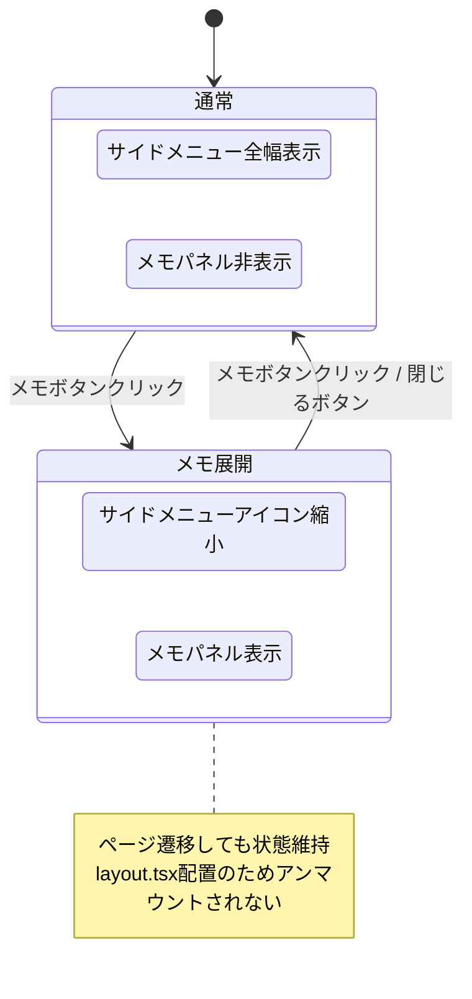

# パーソナルメモパネル 仕様書

> ステータス: **レビュー済み**

## 背景・目的

### Who

チームメンバー（タスク管理ツールの日常利用者）

### What

ダッシュボード上で個人的な作業メモを取り、タスクの確認とメモをアプリ内で完結させる

### Why

- ユーザーが別のメモアプリで「今日やるタスク」や「タスクに関する情報」を管理している現状がある
- アプリから離脱させることなく、プロジェクトに関する作業はこのアプリで完結できるべき
- タスクごとにメモを紐づけると「どこに書いたか分からなくなる」「タスク横断の情報が書けない」という問題がある

### Constraint

- メモはプライベート（本人のみ閲覧可能）
- 既存ダッシュボード（テーブル/カード/ドロワー）と共存必須
- 技術スタック: Next.js + Tailwind + React Aria + Motion + Firebase/Firestore
- 既存のtiptapエディタ資産を活用可能

---

## 機能要件

### Must（Phase 1）

#### 1. メモパネルの開閉

- サイドメニュー内のボタンでメモパネルをトグル開閉できる
- メモパネル展開時、サイドメニューはアイコンのみの縮小表示に切り替わる
- メモエリアの幅はドラッグで調整可能（リサイズハンドル）
- タスク詳細ドロワー表示中もメモパネルは参照可能（ドロワーのオーバーレイより高いz-index、ただしモーダルのオーバーレイよりは低いz-index）
- メモパネルは `app/(dashboard)/layout.tsx` に配置し、ページ遷移してもアンマウントされない
- パネルの幅・開閉状態は localStorage で保存（次回展開時に復元）

#### 2. メモエディタ

- 1ユーザーにつき1つのメモ（単一ドキュメント）
- tiptapリッチテキストエディタ（太字、リンク、箇条書き、チェックボックス）
- メモの内容はユーザーが手動で削除するまで永続する
- メモの内容はプライベート（本人のみ閲覧・編集可能）
- 自動保存: デバウンス 2秒（入力停止後2秒で Firestore に保存）

#### 3. タスクD&Dによるメモ挿入

- タスク一覧（テーブル/カード）からタスクをメモパネルにドラッグ&ドロップできる
- ドロップ時、タスクのタイトルとITアップ日がメモにテキストとして挿入される
- 挿入後はプレーンテキストとして編集可能（タスクとのリンクは維持しない）
- 対応ページ: ダッシュボード（/dashboard）およびタスク一覧（/tasks）
- D&D判定ルール: ドロップ先がテーブル/カード内なら並び替え操作、メモパネル内ならテキスト挿入
  - タスク一覧ページ（/tasks）では並び替え機能は無効のため、D&Dはメモ挿入のみ

### Should（Phase 2）

- メモの自動保存（デバウンス付き、入力停止後N秒で保存）

### Could（Phase 3）

- メモ内のタスク参照をリンク化（クリックでタスク詳細を開く）
- メモのエクスポート（テキスト/マークダウン）

---

## データ構造

```typescript
// Firestoreパス: users/{userId}/personalNotes/{noteId}
// Phase 1では noteId = "default" の単一ドキュメント
interface PersonalNote {
  id: string;
  userId: string;
  content: string; // tiptap HTML形式
  updatedAt: Date;
  createdAt: Date;
}

// localStorage で管理（Firestoreには保存しない）
interface MemoPanel {
  panelWidth: number; // メモパネルの幅（px）
  isPanelOpen: boolean; // パネルの開閉状態
}
```

### Firestoreセキュリティルール

| 操作     | 本人 | 他ユーザー | 未ログイン |
| -------- | ---- | ---------- | ---------- |
| 読み取り | ✅   | ❌         | ❌         |
| 書き込み | ✅   | ❌         | ❌         |

```
match /users/{userId}/personalNotes/{noteId} {
  allow read, write: if request.auth != null && request.auth.uid == userId;
}
```

---

## 画面・UI

### メモパネルの状態遷移



### レイアウト構成

```
通常時:
┌────────────┬──────────────────────────────────┐
│ サイドメニュー │  メインコンテンツ（ダッシュボード）   │
│ （通常幅）    │                                  │
│              │                                  │
│  [📝メモ]    │                                  │
└────────────┴──────────────────────────────────┘

メモ展開時:
┌──┬──────────┬─────────────────────────────────┐
│🏠│  📝 メモ  │  メインコンテンツ（ダッシュボード）  │
│📋│           │                                  │
│⚙️│  □ 作業A  │  タスク一覧テーブル ...             │
│  │  □ 作業B  │                                  │
│  │  ✓ 作業C  │                                  │
│  │           │                                  │
│  │  自由メモ  │                                  │
│  │  ...      │                                  │
│  │      ⇔    │← リサイズハンドル                  │
└──┴──────────┴─────────────────────────────────┘

メモ展開 + 詳細ドロワー（ドロワーはモーダル表示）:
┌──┬──────────┬───────────────────┬──────────────┐
│🏠│  📝 メモ  │  ダッシュボード     │  詳細ドロワー │
│📋│           │  （オーバーレイ）    │              │
│⚙️│  □ 作業A  │                   │  タブ: 詳細   │
│  │  □ 作業B  │                   │  タブ: コメント│
│  │           │                   │              │
│  │  メモは    │                   │              │
│  │  操作可能  │                   │              │
└──┴──────────┴───────────────────┴──────────────┘
  ↑ z-index高  ↑ z-index低（暗転）   ↑ z-index高
```

### D&D操作フロー

```
1. タスク一覧の行（or カード）をドラッグ開始
   - 行全体がドラッグ対象（@dnd-kit のリスナーを TableRow に設定）
2. ドロップ先で操作が分岐:
   a. テーブル内にドロップ → タスクの並び替え（既存動作）
      ※ タスク一覧ページ（/tasks）では並び替え無効
   b. メモパネル内にドロップ → テキスト挿入
3. メモパネルにドラッグオーバー → ドロップ可能を示すハイライト
4. ドロップ → メモのカーソル位置に以下が挿入:
   「タスクタイトル（ITアップ: YYYY/MM/DD）」
5. 挿入後はプレーンテキストとして自由に編集可能
```

---

## エッジケース・制約

### メモパネル

- **メモが空の状態**: プレースホルダーテキスト表示（例：「メモを書いてみよう」）
- **メモパネル幅の最小/最大**: 最小200px〜最大画面幅の50%
- **レスポンシブ**: モバイル幅ではメモパネルは全画面オーバーレイに切り替え（要検討）
- **同時編集**: 複数タブ/デバイスで同じメモを編集した場合 → 最後の保存が勝つ（last-write-wins）
- **オフライン**: Firestore オフライン永続化に委ねる（特別な対応なし）
- **メモの容量**: Firestoreの1ドキュメント上限は1MB。目安として100KBを上限とし、超過時に警告を表示する

### タスクD&D

- **ITアップ日が未設定のタスク**: タイトルのみ挿入（日付部分は省略）
- **メモパネルが閉じている時のD&D**: ドロップ不可（パネルが開いている時のみ有効）
- **カードビューからのD&D**: テーブルビューと同様に動作

---

## 非機能要件

### パフォーマンス

- メモの自動保存: デバウンス 2秒（入力停止後2秒で Firestore に保存）
- メモパネルの開閉アニメーション: 200〜300ms（Motion使用）

### セキュリティ

- メモデータは Firestore セキュリティルールで本人のみアクセス可能に制限（クライアントSDK経由）
- Firebase Console や Admin SDK（Cloud Functions等）からは管理者がデータを閲覧可能。クライアントサイド暗号化は行わない（チーム内ツールとして許容）
- メモの内容はサーバーサイドでサニタイズ不要（tiptap HTML はクライアント側で生成・表示）

---

## スコープ外

- メモの共有機能（他ユーザーへの公開）
- メモのバージョン履歴・Undo
- タスクとメモの構造的なリンク（メモ内のタスク参照からワンクリックで遷移等）
- メモのテンプレート機能
- モバイルアプリ対応

---

## 選定理由

### メモパネルの位置（左サイドバー）

右側のタスク詳細ドロワーと物理的に反対側に配置することで、「タスク詳細を見ながらメモを取る」ユースケースに対応。サイドメニューのアイコン縮小表示により、ナビゲーション機能を維持しつつメモスペースを確保できる。

### レイアウト配置によるSPA永続化

`app/(dashboard)/layout.tsx` にメモパネルを配置することで、ページ遷移時にアンマウントされない。これにより保存前のデータロスを防ぎ、どのページでもメモにアクセスできる。

### 1ユーザー1メモ（単一ドキュメント）

「メモ帳」の気軽さを重視。複数メモ管理はメモの管理自体がタスクになる本末転倒リスクがある。将来的な拡張（Phase 3: 複数タブ）の余地はデータ構造で担保。

### tiptapリッチテキスト

既存のコメント機能で tiptap を導入済みのため、エディタコンポーネントを再利用可能。Todoチェックボックスも tiptap の拡張で実現でき、実装コストが低い。

### パネル状態のlocalStorage管理

パネルの幅や開閉状態はUIの一時的な設定であり、Firestoreに保存するほどの永続性は不要。localStorageで端末ごとに管理する方がシンプルで、Firestoreの読み書きコストも削減できる。
