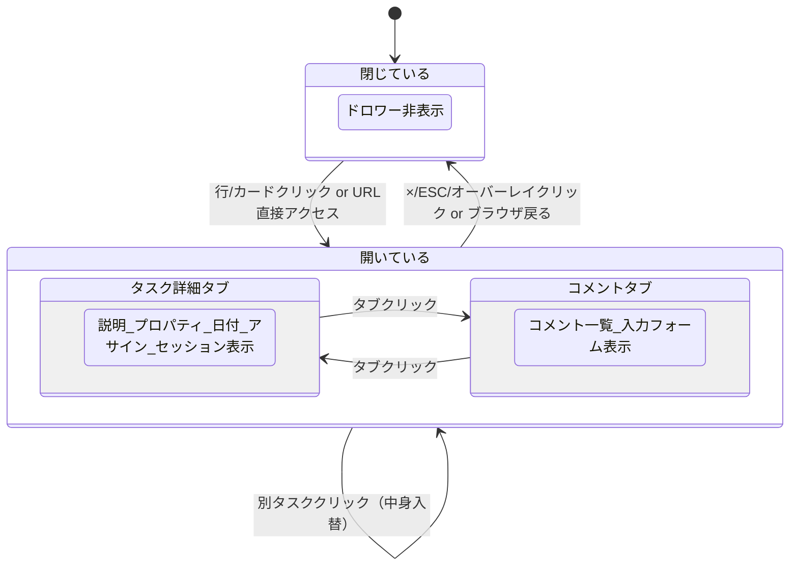
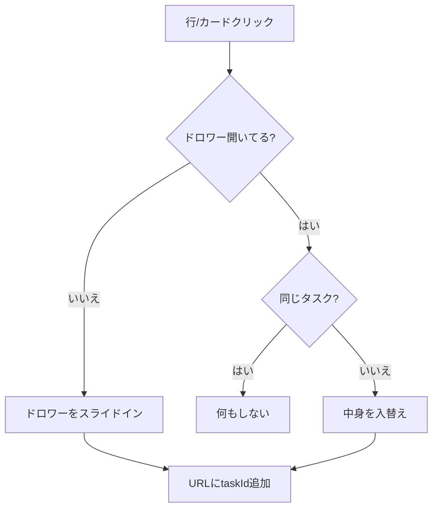
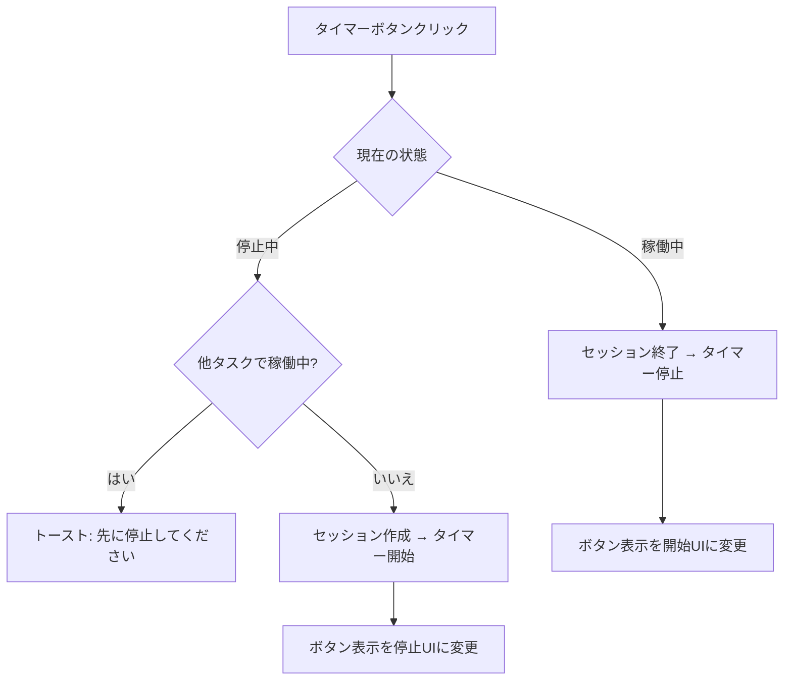
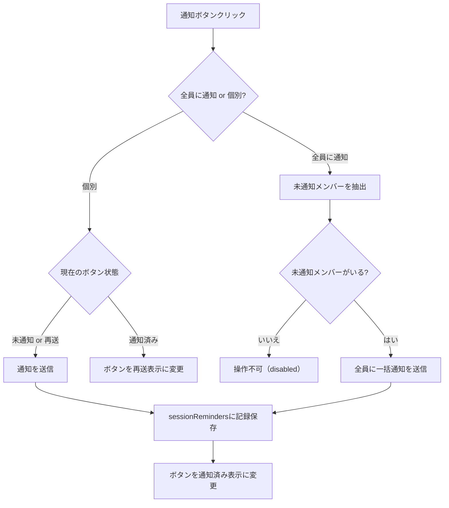
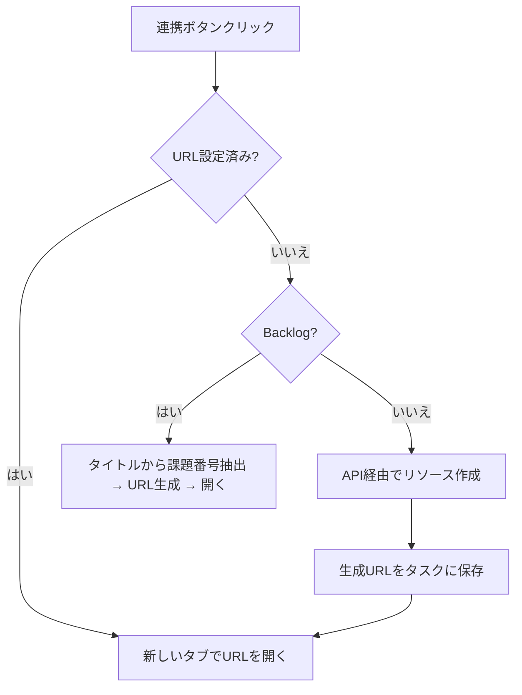

# タスク詳細ドロワー 仕様書

> ステータス: **確定**

## 背景・目的

### Who

チームメンバー（タスク管理ツールの日常利用者）。ダッシュボード・タスク一覧・レポートの各ページからタスクの詳細確認・編集・操作を行う。

### What

タスク一覧から1クリックで、ページ遷移なしにタスクの詳細確認・プロパティ編集・タイマー操作・外部ツール連携・コメントのやりとりをドロワー内で完結させる。

### Why

- ページ遷移なしで素早くタスク情報にアクセスしたい
- タイマー操作・外部ツール連携（Drive/Chat/Backlog等）もドロワー内で完結させたい
- リニューアル（MUI → Tailwind + React Aria + Motion）に向けて、基準となる仕様が必要
- ダッシュボード・タスク一覧・レポートの各ページでドロワーの共通仕様と差分を明確化する

### ドロワーとフルページの使い分け

| 用途                   | ドロワー                  | フルページ (`/tasks/{taskId}`) |
| ---------------------- | ------------------------- | ------------------------------ |
| クイック確認・軽い編集 | ✅ 主な利用シーン         | —                              |
| 長文の説明編集         | △ 可能だがスペース狭い    | ✅ 広い作業スペース            |
| 全履歴の確認           | △ スクロールで確認可能    | ✅ 一覧性が高い                |
| URL共有                | ✅ クエリパラメータで共有 | ✅ パスで共有                  |

ドロワーは「一覧を見ながらサッと確認・編集」する軽量UIの位置付け。より広い作業スペースが必要な場合は「詳細ページを開く」ボタンでフルページに遷移する。

### Constraint

- 技術スタック: Next.js + Tailwind + React Aria + Motion + Firebase/Firestore
- 既存データモデル（Task型、TaskSession型、TaskComment型）をそのまま活用
- `task-list-view.md`（一覧ビュー仕様）・`task-pin.md`（ピン留め仕様）との整合を保つ
- ドロワーは画面右からスライドイン（固定幅）
- 1画面に1つのドロワーのみ表示（複数同時表示なし）

---

## 機能要件

### Must（Phase 1）

#### ドロワー共通動作

##### 開く

- タスク一覧の行クリック（テーブルビュー）またはカードクリック（カードビュー）でドロワーを開く
- 開く際、画面右端からスライドインアニメーション
- 背面にオーバーレイ（半透明の暗幕）を表示
- 開いた状態で別のタスクをクリックした場合、ドロワーの中身を入れ替える（閉じる→開くではない）

##### 閉じる

以下のいずれかの操作で閉じる:

- ×ボタン（ヘッダー右上）クリック
- ESCキー押下
- オーバーレイ部分クリック

閉じる際はスライドアウトアニメーション。

##### URL同期

- ドロワーを開くとURLにタスクIDを反映する
  - ダッシュボード: `/dashboard?task={taskId}`
  - タスク一覧: `/tasks?task={taskId}`
  - レポート: `/report?task={taskId}`
- ドロワーを閉じるとクエリパラメータを除去
- ページロード時にクエリパラメータが存在する場合、自動的にドロワーを開く
- ブラウザの「戻る」操作でドロワーが閉じる（`history.pushState` で管理）

##### 保存方式

- 全プロパティ（ステータス、進捗、区分、日付、説明、3時間超過理由等）は**即時自動保存**
- 値を変更した瞬間にFirestoreへ書き込む
- 保存ボタンは不要
- 保存中のインジケーターは不要（楽観的更新で即座にUIに反映）
- 保存失敗時はトースト通知でエラーを表示し、UIを変更前の値に戻す
- 同時編集の競合解決: **last-write-wins**。プロパティ単位でFirestoreに書き込むため、別プロパティの同時変更は衝突しない。同一プロパティを2人が同時に変更した場合はFirestoreの最後の書き込みが優先される

---

#### タスク詳細ドロワー

ダッシュボード・タスク一覧ページで使用するドロワー。タスクの全情報を確認・編集できる。

##### Header

| 要素             | 仕様                                   |
| ---------------- | -------------------------------------- |
| タイトル         | タスクタイトルをフル表示。折り返しあり |
| ×ボタン          | ドロワーを閉じる                       |
| 詳細ページを開く | クリックで `/tasks/{taskId}` に遷移    |
| 削除             | クリックで削除確認ダイアログ表示       |

**削除確認モーダル（既存パターン準拠）:**

- メッセージ: 「このタスクを削除しますか？この操作は元に戻せません。」
- タイトル入力による確認: 削除対象タスクのタイトルをテキスト入力欄に入力し、完全一致した場合のみ削除ボタンが有効化される
- ボタン: [キャンセル] [削除]（破壊的アクション色、タイトル不一致時は disabled）
- 削除成功時: ドロワーを閉じ、一覧から該当タスクを除去。トースト通知「タスクを削除しました」
- 削除失敗時: トースト通知でエラー表示

##### ActionBar

**タイマーボタン:**

| 状態   | 表示テキスト   |
| ------ | -------------- |
| 停止中 | `タイマー開始` |
| 稼働中 | `タイマー停止` |

- タイマー開始時、別タスクで既にタイマーが動いている場合: **ブロック**。「他のタスクでタイマーが稼働中です。先に停止してください」とトースト表示
- 稼働中の経過時間はリアルタイム更新（1秒ごと）

**外部連携ボタン:**

| ボタン | 連携先                                                        | 未設定時のアクション                            | 設定済み時のアクション     | 保存先フィールド          |
| ------ | ------------------------------------------------------------- | ----------------------------------------------- | -------------------------- | ------------------------- |
| DRIVE  | Google Drive                                                  | フォルダを作成→URLを保存                        | 新しいタブでフォルダを開く | `googleDriveUrl`          |
| CHAT   | Google Chat                                                   | スレッドを作成→URLを保存                        | 新しいタブでスレッドを開く | `googleChatThreadUrl`     |
| FIRE   | GitHub Issues (`monosus/ss-fire-design-system`)               | タスクタイトルでIssueを作成→URLを保存           | 新しいタブでIssueを開く    | `fireIssueUrl`            |
| PET    | GitHub Issues (`monosus/sonysonpo-design-system-and-website`) | `[pet]` + タスクタイトルでIssueを作成→URLを保存 | 新しいタブでIssueを開く    | `petIssueUrl`（新規追加） |

- 未設定/設定済みはボタンの見た目で視覚的に区別する
- 作成中はボタンをdisabledにしてローディング表示

**Backlogボタン:**

| 状態            | 表示                                            |
| --------------- | ----------------------------------------------- |
| URL自動生成可能 | 「BACKLOGを開く」ボタン（プライマリアクション） |
| URL取得不可     | 非表示                                          |

- タイトルからBacklog課題番号を自動抽出してURLを生成
- クリックで新しいタブでBacklogを開く

##### TabBar

| 要素             | 仕様                                                                 |
| ---------------- | -------------------------------------------------------------------- |
| アクティブタブ   | 選択状態が視覚的に明確（アクセント色の下線等）                       |
| 非アクティブタブ | 非選択状態                                                           |
| 未読バッジ       | コメントタブの右に未読インジケーター。未読コメントがある場合のみ表示 |

- タブ: 「タスク詳細」「コメント」の2つ（レポートドロワーでは「レポート詳細」「コメント」）
- タブ切替はURL変更なし（ローカル状態のみ）
- ドロワーを開いた時のデフォルトタブ: **タスク詳細**（レポートドロワーでは**レポート詳細**）

##### Content — タスク詳細タブ

上から順にスクロール可能なコンテンツエリア。

**1. 説明セクション**

- ラベル: `説明`
- 内容: `description` フィールドの値。テキストエリアとして編集可能
- 空の場合: プレースホルダ「説明を入力...」を表示
- フォーカスアウト時に自動保存

**2. プロパティセクション**

各プロパティはラベル + 入力の水平レイアウト:

| プロパティ | ラベル     | 入力タイプ     | 選択肢                         |
| ---------- | ---------- | -------------- | ------------------------------ |
| ステータス | ステータス | ドロップダウン | FlowStatus の全値              |
| 進捗       | 進捗       | ドロップダウン | ProgressStatus の全値 + 未設定 |
| 区分       | 区分       | ドロップダウン | labels コレクションの動的取得  |

- 進捗ドロップダウンには値の横にカラーバッジを表示（色は `task-list-view.md` の ProgressStatus 定義に準拠）
- 値変更時に即時自動保存

**3. スケジュールセクション**

| プロパティ | ラベル     | 入力タイプ   |
| ---------- | ---------- | ------------ |
| ITアップ日 | ITアップ日 | 日付ピッカー |
| リリース日 | リリース日 | 日付ピッカー |

- 表示フォーマット: `yyyy/MM/dd`
- 未設定時: `-` を表示
- 値変更時に即時自動保存

**4. アサインセクション**

- ラベル: `アサイン`
- アバター行: 円形アバター（画像 or イニシャル文字）を横並び表示
  - アバター色はユーザーごとに固定色を割り当て
- `[+]` ボタン: クリックでメンバー選択ポップオーバーを表示
  - プロジェクトに所属するメンバー一覧から選択
- アサイン除去: アバターホバーで×マークをオーバーレイ表示 → ×クリックで除去（誤操作防止のため、アバター直接クリックでは除去しない）
- 変更時に即時自動保存

**5. セッション履歴セクション**

- ラベル: `セッション履歴`
- 各行: アバター + ユーザー名 + 日時（左）、所要時間（右）
- セッションは新しい順で表示
- セッションが0件の場合: 「セッション履歴はありません」テキスト表示

##### Content — コメントタブ

- 既存の `CommentList` コンポーネントを使用
- コメント一覧 + コメント入力フォーム
- 未読管理: **コメントが画面に表示された時点**で既読マーク（IntersectionObserver）
  - 各コメントの `readBy` 配列に自分のUIDを追加
  - タブバーの未読バッジは、未読コメントが0になった時点で消える
  - **パフォーマンス最適化**: スクロール中はバッファリングし、スクロール停止300ms後に一括で既読マーク（Firestore書き込みの頻度を抑制）

---

#### レポートドロワー

レポートページで使用するドロワー。セッション管理に特化した構成。

##### Header

タスク詳細ドロワーと同一構造。

##### BacklogBar

```
┌──────────────────────────────────────┐
│  [✦ BACKLOGを開く]                    │
└──────────────────────────────────────┘
```

- タイマーボタン・外部連携4ボタン（Drive/Chat/Fire/Pet）は**非表示**
- Backlogボタンのみ表示（プライマリアクション）

##### TabBar

タスク詳細ドロワーと同一構造。ただしタブラベルは「レポート詳細」「コメント」。

##### Content — レポート詳細タブ

**1. 3時間超過理由セクション**

- ラベル: `3時間超過理由`
- テキストエリア（複数行入力可能）
- ヒントテキスト: `3時間を超過した場合は理由を記入してください`
- **常に表示**（セッション合計時間に関係なく）
- 保存先: Task の `over3Reason` フィールド
- フォーカスアウト時に自動保存

**2. セッション履歴セクション**

```
セッション履歴    合計: 3時間48分52秒  [!!!!]
👤先 2/13 14:00〜14:39      39分53秒  [✏️][🗑]
👤菊 2/12 10:00〜11:25    1時間25分    [✏️][🗑]
👤長 2/11 09:30〜11:40    2時間10分    [✏️][🗑]
```

- ヘッダー行: 「セッション履歴」 + 「合計: {合計時間}」
- 合計時間が3時間超の場合: 警告色でハイライト表示
- 各セッション行:
  - 左: アバター + ユーザー名 + 日時
  - 右: 所要時間 + 編集ボタン + 削除ボタン
- 編集アイコンクリック: セッション編集モーダルを表示（※別仕様）
- 削除アイコンクリック: 確認ダイアログ後に削除

**3. セッション未記録メンバーセクション**

- ヘッダー行: 「セッション未記録メンバー」ラベル + 「全員に通知」ボタン
- ヒントテキスト: 「以下のメンバーはアサインされていますがセッション履歴がありません」
- 各行: アバター + ユーザー名（左）+ 通知ボタン（右）
- アサイン済みメンバーのうちセッション履歴が0件のメンバーのみ表示
- 全メンバーにセッションがある場合: セクション自体を非表示

**通知ボタン（個別）:**

| 状態     | 表示                                                       | クリック時の動作                                                                    |
| -------- | ---------------------------------------------------------- | ----------------------------------------------------------------------------------- |
| 未通知   | 「通知」（通知アイコン付き）                               | 当該メンバーにセッション未記録の通知を送信し、ボタンを「通知済み」に変更            |
| 通知済み | 「通知済み」（チェックアイコン付き、非アクティブな見た目） | クリックで「再送」に変化                                                            |
| 再送     | 「再送」（通知アイコン付き）                               | 再度通知を送信し、ボタンを「通知済み」に戻す。`sessionReminders` の `sentAt` を更新 |

**「全員に通知」ボタン:**

- ヘッダー右に配置
- クリックで未通知の全メンバーに一括通知を送信
- 通知済みメンバーには再送しない（個別の「再送」ボタンで対応）
- 全員が通知済みの場合: ボタンを非活性化（disabled）
- 送信後、各メンバー行のボタンが「通知済み」に変わる

**通知の内容と権限:**

- 対象メンバーに「タスク『{タスクタイトル}』のセッションが未記録です」という旨の通知を送る
- **送信権限: プロジェクトメンバーなら誰でも送信可能**（チーム内の相互リマインドを促進する目的）
- 通知手段は通知基盤の仕様に準拠（※別仕様）

**通知状態の管理:**

- タスクごと・メンバーごとに「通知済みかどうか」を記録する
- 通知送信日時も保持し、いつ通知したかを追跡可能にする
- 当該メンバーがセッションを記録した場合、次回レポートドロワーを開いた時点でそのメンバーは未記録メンバーセクションから消える（通知状態のリセットは不要）

##### Content — コメントタブ

タスク詳細ドロワーと同一仕様。

---

#### ドロワー使用ページ一覧

| ページ         | ドロワー種類       | 備考                 |
| -------------- | ------------------ | -------------------- |
| ダッシュボード | タスク詳細ドロワー | マイタスクのみ表示   |
| タスク一覧     | タスク詳細ドロワー | 全タスク表示         |
| レポート       | レポートドロワー   | セッション管理に特化 |

---

### Should（Phase 2）

- ドロワー内のプロパティ変更時にリアルタイムで他ユーザーの変更を反映（Firestoreリスナー）
- セッション行のインライン編集（モーダルを開かずに直接時間を修正）
- ドロワーのリサイズ（幅の変更）

### Could（Phase 3）

- ドロワー内でのタスク間ナビゲーション（前/次のタスクに切替）
- アクティビティログタブの追加（誰がいつ何を変更したか）
- ドロワーをフルスクリーンに拡大するオプション

---

## データ構造

この仕様は既存の型をベースに使用する。Task型に `petIssueUrl` フィールドと `sessionReminders` フィールドを追加する。

### 使用する既存型

```typescript
// Firestoreパス: projects/{projectType}/tasks/{taskId}
interface Task {
  id: string;
  projectType: ProjectType;
  external?: TaskExternal; // Backlog連携情報
  title: string;
  description?: string; // 説明テキスト
  flowStatus: FlowStatus;
  progressStatus?: ProgressStatus | null;
  assigneeIds: string[];
  itUpDate: Date | null;
  releaseDate: Date | null;
  kubunLabelId: string;
  googleDriveUrl?: string | null;
  fireIssueUrl?: string | null;
  googleChatThreadUrl?: string | null;
  backlogUrl?: string | null;
  petIssueUrl?: string | null; // PET GitHub Issue URL（新規追加）
  over3Reason?: string; // 3時間超過理由
  sessionReminders?: {
    // セッション未記録通知の送信記録（新規追加）
    [userId: string]: {
      sentAt: Date; // 通知送信日時
      sentBy: string; // 通知を送ったユーザーのID
    };
  };
  order: number;
  createdBy: string;
  createdAt: Date;
  updatedAt: Date;
  completedAt?: Date | null;
}

// Firestoreパス: projects/{projectType}/tasks/{taskId}/sessions/{sessionId}
interface TaskSession {
  id: string;
  taskId: string;
  userId: string;
  startedAt: Date;
  endedAt: Date | null;
  durationSec: number;
  note?: string;
}

// ローカル状態（localStorage永続化）
interface ActiveSession {
  projectType: ProjectType;
  taskId: string;
  sessionId: string;
}

// Firestoreパス: projects/{projectType}/tasks/{taskId}/comments/{commentId}
interface TaskComment {
  id: string;
  taskId: string;
  authorId: string;
  content: string; // tiptap HTML形式
  mentionedUserIds?: string[];
  readBy: string[]; // 既読ユーザーIDの配列
  createdAt: Date;
  updatedAt: Date;
}
```

### Firestoreセキュリティルール

ドロワーが操作するデータのセキュリティルール:

**Task ドキュメント**

| 操作     | プロジェクトメンバー | 他ユーザー | 未ログイン |
| -------- | -------------------- | ---------- | ---------- |
| 読み取り | ✅                   | ❌         | ❌         |
| 書き込み | ✅                   | ❌         | ❌         |
| 削除     | ✅                   | ❌         | ❌         |

**TaskSession サブコレクション**

| 操作     | プロジェクトメンバー       | 他ユーザー | 未ログイン |
| -------- | -------------------------- | ---------- | ---------- |
| 読み取り | ✅                         | ❌         | ❌         |
| 作成     | ✅（自分のセッションのみ） | ❌         | ❌         |
| 編集     | ✅（自分のセッションのみ） | ❌         | ❌         |
| 削除     | ✅（自分のセッションのみ） | ❌         | ❌         |

**TaskComment サブコレクション**

| 操作     | プロジェクトメンバー     | 他ユーザー | 未ログイン |
| -------- | ------------------------ | ---------- | ---------- |
| 読み取り | ✅                       | ❌         | ❌         |
| 作成     | ✅                       | ❌         | ❌         |
| 編集     | ✅（自分のコメントのみ） | ❌         | ❌         |
| 削除     | ✅（自分のコメントのみ） | ❌         | ❌         |

---

## 画面・UI

### 状態遷移



### レイアウト構成

#### タスク詳細ドロワー

```
┌────────────────────────────────┐
│ Header                    (×)  │
│ [→ 詳細ページを開く] [🗑 削除] │
├────────────────────────────────┤
│ [▷ タイマー開始]               │
│ [DRIVE] [CHAT]                 │
│ [FIRE]  [PET]                  │
│ [BACKLOGを開く]                │
├────────────────────────────────┤
│ [タスク詳細] [コメント ●]      │
├────────────────────────────────┤
│ (スクロール可能エリア)          │
│                                │
│ 説明                           │
│ [テキストボックス]              │
│ ────────────                   │
│ ステータス  [dropdown]         │
│ 進捗        [dropdown]         │
│ 区分        [dropdown]         │
│ ────────────                   │
│ ITアップ日  [datepicker]       │
│ リリース日  [datepicker]       │
│ ────────────                   │
│ アサイン                       │
│ 👤👤👤👤 [+]                  │
│ ────────────                   │
│ セッション履歴                 │
│ 👤 2/13 14:00〜  39分53秒     │
│ 👤 2/12 10:00〜  1時間25分    │
└────────────────────────────────┘
```

#### レポートドロワー

```
┌────────────────────────────────┐
│ Header                    (×)  │
│ [→ 詳細ページを開く] [🗑 削除] │
├────────────────────────────────┤
│ [BACKLOGを開く]                │
├────────────────────────────────┤
│ [レポート詳細] [コメント ●]     │
├────────────────────────────────┤
│ (スクロール可能エリア)          │
│                                │
│ 3時間超過理由                  │
│ [テキストエリア]               │
│ ※3hを超過した場合は理由を記入  │
│ ────────────                   │
│ セッション履歴  合計:3h48m52s  │
│ 👤 2/13 14:00〜  39m53s [✏🗑] │
│ 👤 2/12 10:00〜  1h25m  [✏🗑] │
│ 👤 2/11 09:30〜  2h10m  [✏🗑] │
│ ────────────                   │
│ セッション未記録メンバー [全員に通知] │
│ ※アサイン済みだがセッションなし      │
│ 👤菊                      [通知]    │
│ 👤山                    [通知済み]  │
└────────────────────────────────┘
```

### 操作フロー

#### ドロワー開閉フロー



#### タイマー操作フロー



#### セッション未記録通知フロー



#### 外部連携フロー



---

## エッジケース・制約

- **タスクが他ユーザーに削除された場合**: ドロワー表示中にFirestoreのドキュメントが削除された場合、ドロワーを閉じ「このタスクは削除されました」とトースト表示
- **ネットワーク切断時の編集**: 即時保存が失敗した場合、変更をローカルにキューイングし、再接続時に再試行する（Firestoreのオフライン永続化機能を利用）
- **長大なタイトル**: 折り返し表示（省略なし）。タイトルが極端に長い場合でもHeaderのレイアウトが崩れないよう、×ボタンは固定位置
- **アサインが0人**: アサインセクションは`[+]`ボタンのみ表示
- **セッションが0件**: タスク詳細ドロワー: 「セッション履歴はありません」テキスト表示。レポートドロワー: セッション履歴セクションは空、未記録メンバーセクションにアサイン全員表示
- **コメントが0件**: 「まだコメントはありません」テキスト + 入力フォーム
- **未読コメントがない場合**: 未読バッジ非表示
- **Backlog課題番号がタイトルから抽出できない場合**: Backlogボタン非表示
- **説明が空の場合**: プレースホルダ「説明を入力...」を表示
- **3時間超過理由が空の場合**: テキストエリアは空のまま表示（入力必須ではない）
- **レポートドロワーで全メンバーにセッションがある場合**: セッション未記録メンバーセクション自体を非表示
- **全未記録メンバーが通知済みの場合**: 「全員に通知」ボタンを非活性化（disabled）。各行のボタンはすべて「通知済み」表示。個別に「通知済み」→「再送」→送信は可能
- **通知送信に失敗した場合**: トースト通知でエラー表示。ボタンは「通知」状態のまま維持（通知済みに変えない）
- **同時に2つのドロワーは開かない**: ドロワーは常に1つだけ。タスクドロワーとレポートドロワーが同一ページに共存することはない（ページ種別で決定）
- **ドロワー表示中のビュー切替（テーブル⇔カード）**: ドロワーは開いたまま。一覧の表示のみ変わる
- **ページネーション操作**: 表示中のタスクがページから外れた場合、ドロワーは開いたまま維持

---

## 非機能要件

### パフォーマンス

- ドロワーの開閉アニメーション: 遅延を感じさせない速度
- 即時保存のレイテンシ: ユーザーに遅延を感じさせない（楽観的更新）
- セッション履歴・コメントは遅延ロード（ドロワーを開いた時にフェッチ）
- タイマー経過時間の更新: 1秒ごと（`requestAnimationFrame` ではなく `setInterval` でOK）
- コメントの未読判定: IntersectionObserverで画面内に入った時のみFirestore書き込み（スクロールごとに書き込まない）

### セキュリティ

- タスクの読み書きはプロジェクトメンバーのみ（Firestoreルールで担保）
- セッションの編集・削除は自分のセッションのみ
- コメントの編集・削除は自分のコメントのみ
- 外部URL（Drive/Chat/Fire/Pet/Backlog）は新しいタブで開く（XSS防止: `rel="noopener noreferrer"`）

### アクセシビリティ

- ドロワーは `role="dialog"` + `aria-modal="true"` + `aria-label="タスク詳細"`
- フォーカストラップ: ドロワー内にフォーカスを閉じ込める
- ESCキーで閉じる
- タブ・ドロップダウン・日付ピッカーはキーボード操作可能（React Ariaで担保）
- スクリーンリーダー: 各セクションにaria-labelを設定

---

## スコープ外

- セッション未記録通知の配信手段の詳細仕様（メール/プッシュ/アプリ内通知等）— 通知基盤の仕様で管理
- セッション編集モーダルの詳細仕様（別仕様書で管理）
- コメントの詳細仕様（メンション、リッチテキスト編集、通知） — 既存実装に準拠
- ダークモードのカラー詳細定義 — デザインシステムで管理
- モバイルレスポンシブ対応（ドロワーのフルスクリーン化等）
- 外部連携のリソース作成API仕様（Drive/Chat/Fire/Pet）— 既存実装に準拠
- ドロワーのキーボードショートカット（J/Kで次/前のタスクに移動等）
- レポートドロワー内でのタスク基本情報（ステータス・進捗・区分等）の表示 — セッション管理に特化しているため、タスク情報の確認は「詳細ページを開く」ボタンで対応

---

## 選定理由

### 即時自動保存の採用

値変更時に即座にFirestoreへ書き込む方式を選択した。

**比較した代替案:**

- **A: 明示的保存ボタン** — ユーザーが保存を忘れてドロワーを閉じるとデータ消失のリスク。保存ボタンの配置場所も悩ましい
- **B: ドロワー閉じる時に一括保存** — 閉じ方が多数（×/ESC/オーバーレイ/別タスククリック）あり、全経路で保存を確実に呼ぶのが複雑

**即時保存を選んだ理由:** 既存実装も即時保存方式。ユーザーの操作を最小化し、データ消失リスクを排除できる。Firestoreのオフライン永続化と組み合わせることで、ネットワーク断でも安全。

### URLへのタスクID反映

ドロワー表示時にURLクエリパラメータにタスクIDを反映する方式を選択した。

**メリット:**

- URLを共有するだけでチームメンバーに特定タスクのドロワーを開かせられる
- ブラウザの「戻る」が直感的に機能する（ドロワーが閉じる）
- ページリロードしてもドロワーが復元される

### タイマー競合時のブロック方式

別タスクで既にタイマーが動いている場合、新しいタイマーの開始をブロックする方式を選択した。

**比較した代替案:**

- **A: 自動切替** — 確認ダイアログ付きで前のタイマーを自動停止。便利だが、意図せず前タスクのセッションが短く切られるリスク
- **C: 同時起動許可** — 複数タスクのタイマーを同時に動かせる。実装は単純だが、作業時間の計測精度が下がる

**ブロックを選んだ理由:** タイマーは作業時間の正確な計測が目的。「1人が同時に2つのタスクを作業している」状態は現実的でなく、意図しない二重計測を防止できる。
