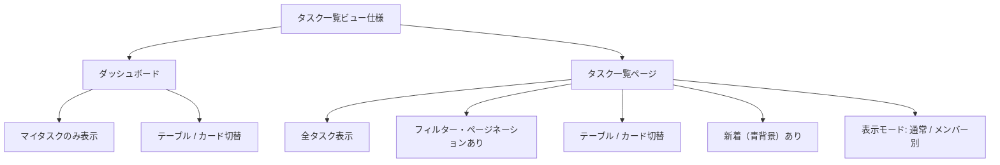
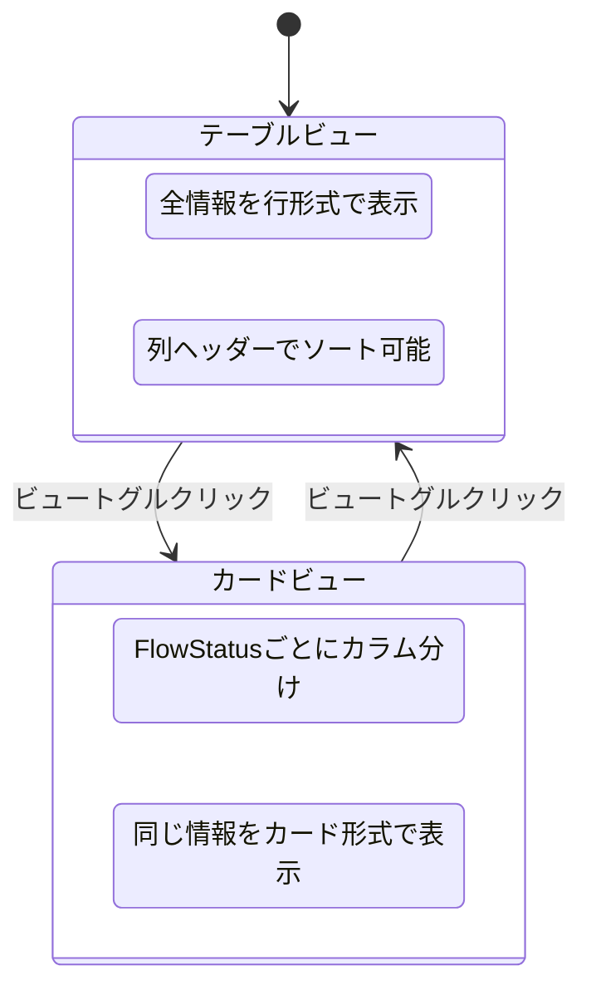
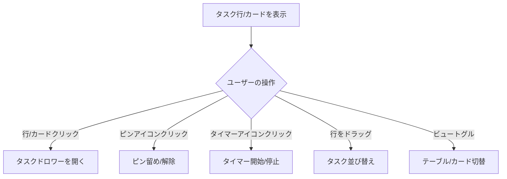

# タスク一覧ビュー 仕様書

> ステータス: **レビュー済み**

## 背景・目的

### Who

チームメンバー（タスク管理ツールの日常利用者）。ダッシュボード・タスク一覧の2ページでタスクを閲覧・操作する。

### What

テーブルビューとカードビューの間で、表示する情報・表現ルール・操作を統一し、どちらのビューでも同等の情報を得られるようにする。

### Why

- デザインファイルの各フレームが独立して作られ、情報項目・日付フォーマット・背景色ルールがビュー間・ページ間でバラバラ
- ビュー切替時に情報が欠落し、ユーザーがテーブルに戻らないと確認できない項目がある
- 行/カード背景色（期限ベース）のルールが明文化されておらず、実装の判断基準がない
- リニューアル（MUI → Tailwind + React Aria + Motion）に向けて、基準となる仕様が必要

### Constraint

- 技術スタック: Next.js + Tailwind + React Aria + Motion + Firebase/Firestore
- 既存データモデル（Task型）はそのまま活用。新規コレクション不要
- ダッシュボード / タスク一覧の2ページで共通仕様を適用
- ピン留め仕様（`docs/specs/dashboard/task-pin.md`）との整合を保つ
- カード幅360pxの制約内で全情報を収める

---

## 機能要件

### Must（Phase 1）

#### 表示項目の統一

テーブルとカードで**同じ情報項目**を表示する（レイアウトは異なる）。

| #   | 情報項目         | テーブル表現                                   | カード表現                                     |
| --- | ---------------- | ---------------------------------------------- | ---------------------------------------------- |
| 1   | タイトル         | テキスト（1行、overflow省略）                  | テキスト（最大2行、clamp）                     |
| 2   | アサイン         | アバターアイコン（重ねて表示、最大5人+残数）※1 | アバターアイコン（重ねて表示、最大5人+残数）※1 |
| 3   | IT日             | テキスト `yyyy-MM-dd`                          | テキスト `yyyy-MM-dd`                          |
| 4   | PR日             | テキスト `yyyy-MM-dd`（ITの下に2行表示）       | テキスト `yyyy-MM-dd`（ITの下に2行表示）       |
| 5   | フローステータス | テキスト列                                     | カラムグルーピング（セクションヘッダー）       |
| 6   | 進捗バッジ       | カラーバッジ                                   | カラーバッジ                                   |
| 7   | 区分             | テキスト                                       | テキスト                                       |
| 8   | タイマー         | 小アイコン                                     | 小アイコン                                     |
| 9   | ピンアイコン     | 最左列に常時表示                               | _(Phase 2で追加)_                              |
| 10  | 未読バッジ       | タイトル左に青丸                               | タイトル左に青丸                               |

※1 **アサインアバターの画像取得元**: Firestoreの `users/{userId}` コレクションのプロフィール画像を使用。画像未設定の場合は `displayName` のイニシャルをアバターに表示

#### タイトル表示ルール

- タイトルは**フル表示**（チケット番号 + 【担当者】 + 説明を含む）
- 例: `REG2017-2266【飯田】火災_SEO記事コンテンツ（リライト）`
- テーブル: 1行表示、はみ出し部分は `...` で省略
- カード: 最大2行、`-webkit-line-clamp: 2` で省略

#### 日付表示ルール

- **IT日・PR日の両方**を常に表示する
- フォーマット: `yyyy-MM-dd`（テーブル・カード共通）
- 日付が未設定（null）の場合: `-` を表示
- 2行構成:
  - 1行目: IT日
  - 2行目: PR日

#### 行/カード背景色ルール

タスクの状態に応じて背景色を付ける。**優先度順に判定し、最初にマッチした色を適用**する。

| 優先度 | 条件                               | 背景色 | セマンティックトークン | 対象ページ     |
| ------ | ---------------------------------- | ------ | ---------------------- | -------------- |
| 1      | IT日 < 今日（期限超過）            | 赤     | `color-error-bg`       | 全ページ       |
| 2      | IT日まで7日以内（期限間近）        | 黄     | `color-warning-bg`     | 全ページ       |
| 3      | 未アサイン AND 作成7日以内（新着） | 青     | `color-info-bg`        | タスク一覧のみ |
| 4      | 上記に該当しない（通常）           | なし   | —                      | 全ページ       |

**判定の前提条件:**

- IT日が未設定（null）の場合: 期限超過・期限間近の判定はスキップ（通常扱い）
- フローステータスが `完了` のタスク: 背景色を付けない（通常扱い）
- 進捗が**完了・連絡段階**（IT連絡済み / ST連絡済み / SENJU登録）のタスク: 期限ベースの背景色（赤・黄）を付けない（通常扱い）
- 「7日以内」は当日を含む（今日がIT日なら期限間近）
- 日数はカレンダー日数で判定する（土日祝は考慮しない）
- 閾値（7日）は定数として管理し、運用後の調整を容易にする

#### フローステータスの表現

| ビュー   | 表現方法                                           |
| -------- | -------------------------------------------------- |
| テーブル | テキスト列で表示（ディレクション、コーディング等） |
| カード   | FlowStatusごとにカラムに分けてグルーピング         |

**カードビューのカラム表示順序:**

```
未着手 > 待ち > ディレクション > デザイン > コーディング > （完了）
```

- 全カラムを常に表示する（タスクが0件でもカラム自体は残り、カードがない状態になる）
- フィルター等でFlowStatusが `完了` のタスクが表示対象に含まれる場合、完了カラムを右端に一時的に追加表示する
- 各カラムにはセクションヘッダー（ステータス名 + タスク数バッジ）を表示
- カラム内のカードは `order` フィールド順で表示（テーブルのソート順と一致）
- フィルター・ソート設定はテーブル/カード間で共有される

#### 進捗バッジ

- `ProgressStatus` の値に応じたカラーバッジで表示（段階・色の定義は「進捗ステータス定義」を参照）
- 進捗が未設定（null）の場合: バッジ非表示

#### カードビューでのD&Dによる並び替え

- カラム内のカードをドラッグして並び順を変更できる
- ドラッグ先はカラム内のみ（FlowStatusの変更はドラッグでは行わない）
- 並び順の変更は `order` フィールドに反映
- `order` の初期値: タスク作成時に末尾追加（既存タスクの最大order + 1）
- テーブルの列ヘッダーソートとの関係: ソート適用中はD&D無効（order順表示時のみD&D可能）

#### メンバー別表示のカードビュー対応

- タスク一覧ページのメンバー別表示でもテーブル/カード切替を提供する
- カードビューではメンバーごとのセクション内でFlowStatusカラムを表示

### Should（Phase 2）

- カードビューでのピンアイコン表示（カード左上にアイコン）
- カードビューでのピン留め操作（カード角のピンアイコンクリック）
- ピン留めタスクのカードビューでの上部固定表示
- カードをカラム間でD&DしてFlowStatusを変更できるようにする

### Could（Phase 3）

- カードのホバーでの詳細プレビュー
- テーブル列の表示/非表示カスタマイズ

---

## データ構造

この仕様は既存の `Task` 型をそのまま使用する。新規コレクション・フィールドは不要。

```typescript
// 既存: projects/{projectType}/tasks/{taskId}
interface Task {
  id: string;
  projectType: ProjectType;
  title: string;
  flowStatus: FlowStatus;
  progressStatus?: ProgressStatus | null;
  assigneeIds: string[];
  itUpDate: Date | null;
  releaseDate: Date | null;
  kubunLabelId: string;
  order: number;
  createdBy: string;
  createdAt: Date;
  updatedAt: Date;
  completedAt?: Date | null;
  // ...その他のフィールド（表示に直接関係ないものは省略）
}
```

### フローステータス（FlowStatus）定義

タスクの作業工程を表す。テーブルではテキスト列、カードビューではカラムグルーピングに使用。

| #   | 値             | 説明                   |
| --- | -------------- | ---------------------- |
| 1   | 未着手         | まだ作業に入っていない |
| 2   | ディレクション | 要件整理・方向性検討中 |
| 3   | コーディング   | 実装作業中             |
| 4   | デザイン       | デザイン作業中         |
| 5   | 待ち           | 外部要因で待機中       |
| 6   | 完了           | 作業完了               |

### 進捗ステータス（ProgressStatus）定義

タスク内の細かい進捗を表す。段階ごとに色系統を分けたカラーバッジで表示。

#### 準備・計画段階（Purple 500→900）

| #   | 値       | バッジ色     |
| --- | -------- | ------------ |
| 1   | 未着手   | `purple-500` |
| 2   | 仕様確認 | `purple-600` |
| 3   | 待ち     | `purple-700` |
| 4   | 調査     | `purple-800` |
| 5   | 見積     | `purple-900` |

#### 実作業段階（Pink 500→900）

| #   | 値             | バッジ色   |
| --- | -------------- | ---------- |
| 6   | CO             | `pink-500` |
| 7   | ロック解除待ち | `pink-600` |
| 8   | デザイン       | `pink-700` |
| 9   | コーディング   | `pink-800` |
| 10  | 品管チェック   | `pink-900` |

#### 完了・連絡段階（Cyan 500→700）

| #   | 値         | バッジ色   |
| --- | ---------- | ---------- |
| 11  | IT連絡済み | `cyan-500` |
| 12  | ST連絡済み | `cyan-600` |
| 13  | SENJU登録  | `cyan-700` |

> **背景色ルール除外**: この段階に進んだタスクは期限ベースの背景色（赤・黄）を適用しない。作業が完了フェーズに入っているため、期限超過・期限間近の警告は不要。

#### 特殊（Neutral 600）

| #   | 値     | バッジ色      |
| --- | ------ | ------------- |
| 14  | 親課題 | `neutral-600` |

- 進捗が未設定（null）の場合: バッジ非表示
- バッジはテキスト色: 白、角丸: `radius-full`

### 区分（KubunLabel）定義

タスクの分類を表す。Firestoreの `labels` コレクションで管理。

| #   | 値   | 説明             |
| --- | ---- | ---------------- |
| 1   | 個別 | 個別対応のタスク |
| 2   | 運用 | 運用系のタスク   |

- `kubunLabelId` で `labels` コレクションを参照
- ラベルは全プロジェクト共通（`projectId: null`）
- 将来的にラベルの追加が可能（Firestoreで動的管理）
- 表示はテキストのみ（色の付与はしない）

### 背景色判定に使うフィールド

| 判定       | 使用フィールド                                                                                               |
| ---------- | ------------------------------------------------------------------------------------------------------------ |
| 期限超過   | `itUpDate` < `today` AND `flowStatus !== '完了'` AND `progressStatus` が完了・連絡段階でない                 |
| 期限間近   | `itUpDate` <= `today + 7日` AND `flowStatus !== '完了'` AND `progressStatus` が完了・連絡段階でない          |
| 新着       | `assigneeIds.length === 0` AND `createdAt` >= `today - 7日`                                                  |
| 背景色なし | 上記いずれにも該当しない場合（`flowStatus === '完了'` または `progressStatus` が完了・連絡段階の場合も含む） |

---

## 画面・UI

### ページ別の適用範囲



### テーブルビュー レイアウト

```
┌──────────────────────────────────────────────────────────────────────┐
│ 📌 │ タイトル                    │ アサイン  │ IT   │ ステータス │ 進捗     │ 区分 │ ⏱ │
│    │                             │           │ PR   │           │          │      │    │
├──────────────────────────────────────────────────────────────────────┤
│ 📌 │ 🔴 REG2017-2266【飯田】火… │ 👤👤👤  │ 2026-02-06 │ ディレク… │ [待ち]   │ 運用 │ ▶ │
│    │                             │          │ 2026-02-08 │           │          │      │    │
├──────────────────────────────────────────────────────────────────────┤
│ ◻  │ MONO-431 火災保険追いつき…  │ 👤👤    │ -          │ コーディ… │ [コーディ]│ 運用 │ ▶ │
│    │                             │          │ -          │           │          │      │    │
└──────────────────────────────────────────────────────────────────────┘
 ↑ピン列  ↑未読:青丸  ↑アバター                                                   ↑タイマー
```

**テーブル列幅:**

| 列         | 幅             | 備考             |
| ---------- | -------------- | ---------------- |
| ピン       | 28px           | アイコンのみ     |
| タイトル   | fill（残り幅） | 可変幅           |
| アサイン   | 100px          | アバター重ね表示 |
| IT/PR      | 96px           | 2行表示          |
| ステータス | 110px          | 固定幅           |
| 進捗       | 100px          | バッジ表示       |
| 区分       | 40px           | 固定幅           |
| タイマー   | 48px           | アイコンのみ     |

### カードビュー レイアウト

```
カード（幅360px）:
┌─────────────────────────────────────┐
│ REG2017-2266【飯田】火災_SEO記事 🔴│  ← タイトル(2行) + 未読
│ コンテンツ（リライト）              │
│                                     │
│ 👤👤👤                              │  ← アサインアバター
│                                     │
│ IT  2026-02-06                │  ← 日付2行
│ PR  2026-02-08                │
│                                     │
│ [待ち]              運用       ▶   │  ← 進捗 + 区分 + タイマー
└─────────────────────────────────────┘
```

**カードグリッド:**

```
┌─ 未着手 (0) ─┬─ 待ち (2) ────┬─ ディレクション (3) ┬─ デザイン (0) ┬─ コーディング (1) ┐
│              │ [Card]        │ [Card]              │              │ [Card]            │
│              │ [Card]        │ [Card]              │              │                   │
│              │               │ [Card]              │              │                   │
└──────────────┴───────────────┴─────────────────────┴──────────────┴───────────────────┘
  ↑0件でもカラム表示
```

- カラム幅: `fill`（均等分配）
- カラム間: gap 16px
- カード間: gap 8px
- カード内padding: 12px
- カード角丸: `radius-md`

### ビュー切替



- ツールバーにビュートグル（テーブル/カードアイコン）を配置
- 切替時に情報の欠落はない（情報パリティ）
- ビュー選択はページ単位で永続化する（localStorage）。ページ遷移後も前回のビュー選択を維持

### 操作フロー



---

## エッジケース・制約

- **IT日が未設定**: 期限超過・期限間近の判定はスキップ。背景色は通常（なし）。ただし新着判定は別途行う
- **アサインが0人**: アサイン欄は空表示。カードのアバター欄も非表示
- **アサインが6人以上**: テーブル・カードともにアバター5つ+`+N`表示
- **タイトルが極端に長い**: テーブル1行省略、カード2行clamp。ツールチップでフル表示
- **進捗が未設定（null）**: バッジ非表示。テーブルのセルは空
- **完了タスクの背景色**: 完了タスクには期限ベースの背景色を付けない（完了後に赤くなるのは不自然）
- **同時に複数条件を満たす場合**: 期限超過 > 期限間近 > 新着 の優先度で1色のみ適用
- **カードビューでタスク0件のステータス**: カラムは常に表示。カードがない空状態になる
- **完了タスクのカードビュー表示**: 通常は完了カラムを表示しない。フィルター等で完了タスクが表示対象に含まれる場合のみ、完了カラムを右端に一時追加する
- **フィルター適用時のカードビュー**: フィルター結果に含まれるタスクのみ表示。ステータスカラムのタスク数もフィルター後の数を反映
- **ダッシュボードの新着**: ダッシュボードは「マイタスク」（自分がアサインされたタスク）のみ表示するため、新着（未アサイン）判定は該当しない。青背景はタスク一覧ページ専用

---

## 非機能要件

### パフォーマンス

- ビュー切替（テーブル ↔ カード）は即座に反映（再フェッチ不要、同じデータを使う）
- 背景色判定はクライアントサイドで算出（Firestoreクエリに影響しない）
- カードビューのアバター画像は遅延ロードする

### アクセシビリティ

- 背景色だけに依存しない: 期限超過・期限間近はアイコンやテキストでも識別可能にする
- カードビューはキーボードナビゲーション対応（React Ariaのgrid pattern）
- ビュートグルは `aria-pressed` で状態を伝達

---

## スコープ外

- テーブル列の表示/非表示カスタマイズ（Could: Phase 3）
- レスポンシブ対応（モバイルレイアウト）
- ダッシュボードのサマリーカード — 別仕様書で管理
- デザイントークン（色・フォント・スペーシング等の具体値）の定義 — デザインシステムで管理

---

## 選定理由

### 情報パリティ（アプローチB）の採用

テーブルとカードで同じ情報を表示する方針を選択した。

**比較した代替案:**

- **A: 役割分離型** — カードは要点のみ（アサイン・タイマー省略）。実装コストは低いが、ビュー切替のたびにテーブルに戻る必要があり、カードビューの実用性が低い
- **C: カード拡張型** — カードにホバー詳細やインラインアクションを追加。モダンだが実装コストが高く、操作の学習コストも増える

**Bを選んだ理由:**

- ビュー切替時に情報が欠落しないため、ユーザーが好みのビューで作業を完結できる
- カードへの追加項目（アバター・タイマー・ピン）はいずれもコンパクトに収まるUI要素
- テーブルのデータをそのまま使うため、データ層の変更は不要

### 日付フォーマット統一（yyyy-MM-dd）

- テーブルとカードでフォーマットを揃えることで、認知負荷を下げる
- 年を含めることで年度をまたぐタスクでも曖昧さがない
- ISO 8601準拠でソートと一致する

### 期限間近の閾値（7日）

- 開発チームの作業サイクル（週単位）を考慮し、1週間前から注意喚起
- 3日では気づいた時点でリカバリが困難。7日あれば対応計画を立てられる
